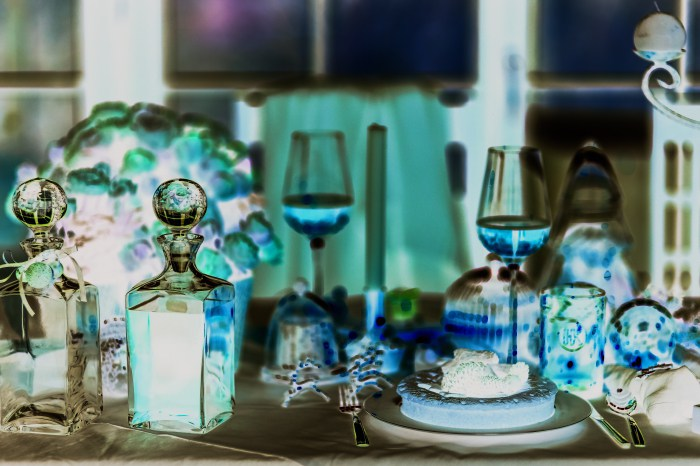

### Width

Set the width of an image. Defaults to pixels, supports percentages.

```php
//for pixels
new Width(300);

//for percent
new Width('20%');
```

Original image:<br>


After<br>


> Image Source
> https://www.pexels.com/photo/close-up-of-fruits-hanging-on-tree-257840/


### Height
Set the height of an image. Defaults to pixels, supports percentages.
```php
//for pixels
new Height(300);

//for percent
new Height('20%');
```

### Crop
Crop an image by percentages x-offset,y-offset,width,height (x,y,w,h). 
Percentages are used so that you don’t need to recalculate the cropping when transforming the image in other ways such as resizing it.

Original image:<br>


```php
new Crop('250px','250px','700px','600px');

```
250px,250px,700px,700px takes a 700px by 700px rectangle from the source image starting at 250px offset from the left and 250px offset from the top.


After:<br>


```php
new Crop('160px','25','1400px','60');

```
shows you can also mix the parameters types, for example a 1400 pixels by 60% rectangle from the image starting at 160 pixels by 25%.


> Image Source
> https://www.pexels.com/photo/branches-daylight-environment-flowers-355296/


### Resize
Resize and crop an image to exact width,height pixel dimensions. Set the first number as close to the target size as possible and then crop the rest. Which direction it’s resized and cropped depends on the aspect ratios of the original image and the target size.

```php
new Resize(400,250);

```

This is useful for taking an image of any size and making it fit into a certain location while losing as little of the image as possible.


### Fit
Fit an image to a containing box of width,height dimensions. Image aspect ratio is maintained.

```php
new Fit(300,300);

```

### LetterBox
Add black letterboxing effect to images, by scaling them to width, height while maintaining the aspect ratio and filling the rest with black.

```php
new LetterBox(700,600);

```
Original image: <br>


After:<br>


> Image Source
> https://www.pexels.com/photo/beach-beautiful-bridge-carribean-449627/

### UnLetterBox
Remove black letterboxing effect from images with ulb. This function takes only one argument, true.
```php
new UnLetterBox(true);

```

### Filter
The filter GET parameter is optional and is used to apply one of multiple filters. 
Valid values are: *negate, grayscale, sepia, edgedetect, emboss, blurgaussian, blurselective, meanremoval*.

```php
new Filter($filterName);
```

<p>
    
    <em>original</em>
</p>

<p>
    
    <em>negate</em>
</p>

<p>
    
    <em>grayscale</em>
</p>
<p>
    
    <em>sepia</em>
</p>
<p>
    
    <em>edgedetect</em>
</p>
<p>
    
    <em>emboss</em>
</p>


> Image Source
> https://www.pexels.com/photo/beautifully-served-table-for-dinner-6269/